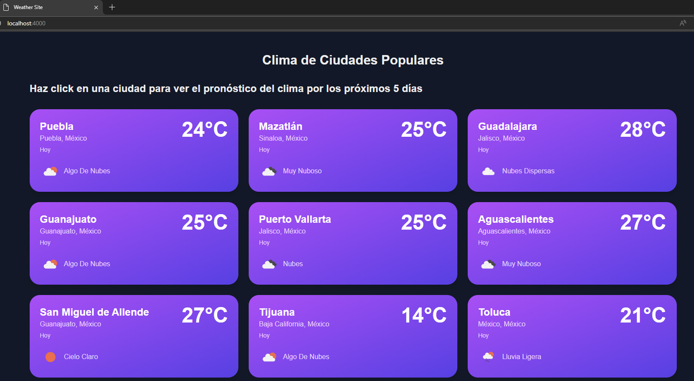
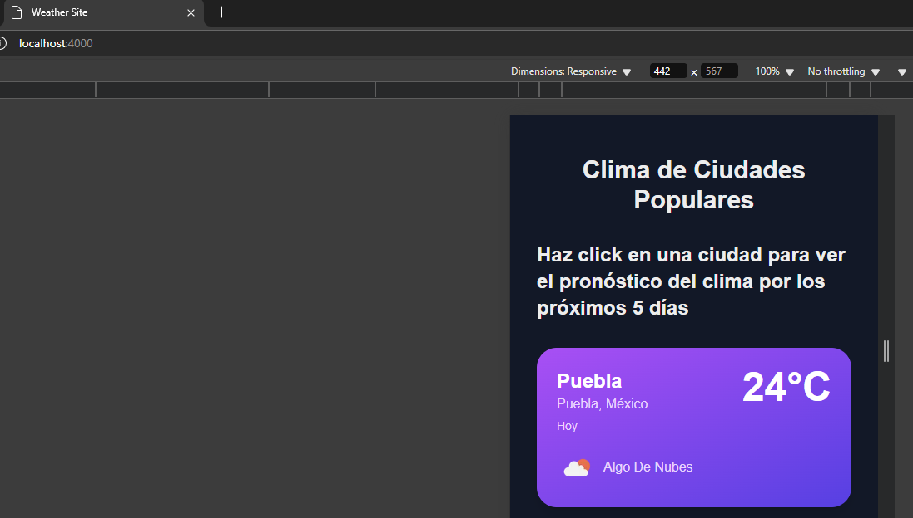
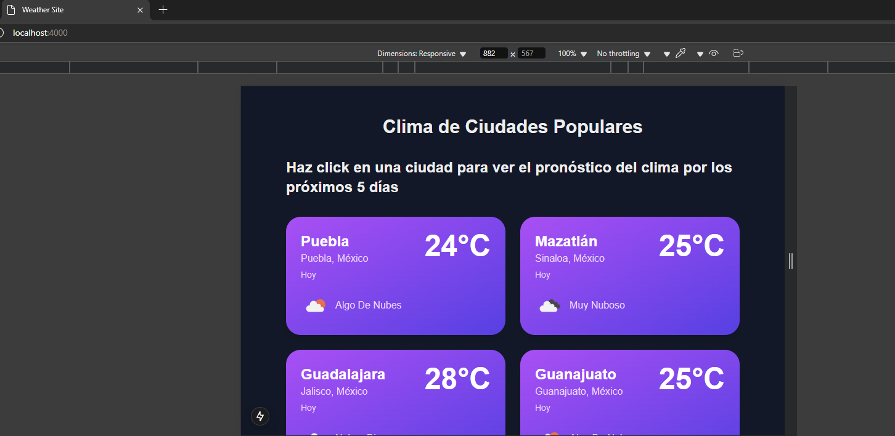
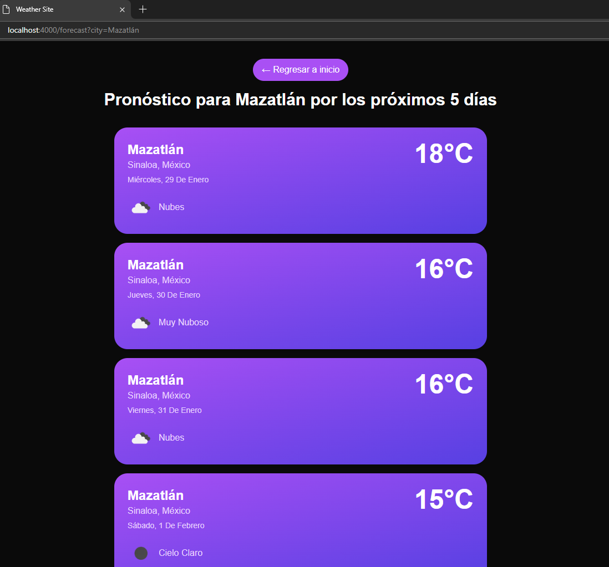

# Weather Site 🌤️

## Descripción del Proyecto

Weather Site es una aplicación web que permite visualizar el pronóstico del clima de las ciudades más populares de México a partir de la [API de Reservamos](https://search.reservamos.mx/api/v2/places) y [OpenWeather](https://openweathermap.org/api). La aplicación muestra tanto el clima actual como un pronóstico estimado para los próximos 5 días.

## Características Principales

- 📍 Visualización del clima actual de múltiples ciudades
- 📅 Pronóstico estimado de 5 días
- 💾 Caché de datos con Redis para optimizar el rendimiento
- 📱 Diseño responsivo para todas las pantallas

## Tecnologías Utilizadas

### Frontend

- **Next.js 14**
- **React**
- **TypeScript**
- **Tailwind CSS**

### Backend

- **NestJS**
- **TypeScript**
- **Redis**

### Servicios Externos

- **OpenWeather API**: Proveedor de datos meteorológicos
- **Reservamos API**: Proveedor de datos de las ciudades

### DevOps

- **Docker**: Contenerización de la aplicación
- **Docker Compose**: Orquestación de servicios

## Configuración del Proyecto

### Prerrequisitos

- Docker y Docker Compose instalados
- Una API key de OpenWeather (puedes obtenerla [aquí](https://openweathermap.org/api))

### Pasos para Iniciar el Proyecto

1. Clonar el repositorio:

```bash
git clone https://github.com/tu-usuario/weather-site.git
cd weather-site
```

2. Crear archivo para las variables de entorno:

```bash
cp .env.example .env
```

3. Configurar las variables de entorno

```bash
# Backend config
BACKEND_PORT=3005
OPEN_WEATHER_API_KEY=tu_api_key_aquí

# Redis config
REDIS_PORT=6379
REDIS_HOST=redis

# Frontend config
FRONTEND_PORT=4000
WEATHER_API_URL=http://weather-api:3005/api
```

**Importante**: Si no vas a utilizar `docker-compose` hay que colocar `Weather_API_URL=http://localhost:3005/api`. E igual si se modifica algun puerto.
También debe notarse que si no se utiliza `docker-compose` debe crearse un archivo `.env` con las variables de entorno tanto para `weather-api` como para `weather-client`.

4. Construir los contenedores:

```bash
docker-compose up -d --build
```

5. Acceder a la aplicación:

- Frontend: http://localhost:4000
- Backend: http://localhost:3005/api

## Información Adicional del Proyecto

- Para más información y detalles, sobre el desarrollo del proyecto puedes consultar el archivo [desarrollo.md](./docs/desarrollo.md) en la carpeta `docs`.
- Se incluye también una colección de [Postman](./docs/Weather-API.postman_collection.json) con ejemplos de uso de la API.

## Estructura del Proyecto

```
weather-site
│   README.md
│   Dockerfile
│   docker-compose.yml
│   .env
│
└───weather-api # Proyecto Backend
│
└───weather-client # Proyecto Frontend
```

## Visualización del Proyecto

### Vista principal



### Vista Principal en dispositivos móviles



### Vista Principal en tablets



### Vista de Pronóstico



