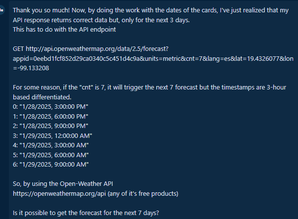

# Proceso de Desarrollo y Toma de Decisiones sobre el Proyecto

## Desarollo

### Backend

Decidí utilizar `NestJS` para el backend debido a que es un framework de `Nodejs` que permite crear APIs RESTful de manera sencilla, rápida y escalable. Además de que es una tecnología con la que he tenido la oportunidad de trabajar bastante por lo que me siento cómodo usándola.

En cuanto al desarrollo de la API por sí misma, solamente se habilitaron dos endpoints:

```http
GET http://localhost:3005/api/places
```

Destinado a proveer una lista de ciudades populares de la API de Reservamos asi como incluir la información del clima basandonos en la ubicación de la ciudad, consultando la API de OpenWeather.

```http
GET http://localhost:3005/api/places/forecast?lat={{lat}}&lon={{long}}
```

Destinado a proveer el pronóstico del clima de la ciudad para los próximos 5 días, consultando directamente la API de OpenWeather.

En ambos endpoints se utiliza `Redis` para almacenar la información obtenida para mejorar el rendimiento de la API. Para comprobar esto se pueden hacer algunas comparaciones entre la primera vez que se invoca el endpoint y la segunda vez, la cual debería ser más rápida ya que se ha almacenado la información en cache.

La lógica principal de todos estos procesos se puede ver en el archivo `weather-api/src/modules/place/place.service.ts`.

Un punto importante que quisiera resaltar es que como tal, no se puede propcionar el pronóstico para **7 días** como se menciona en los requerimientos, sino solo para **5 días** y es que, la capa gratuita de `OpenWeather` únicamente ofrece el endpoint `5 day / 3 hour forecast` para predicciones de clima. Esto llevo a un pequeño inconveniente para agrupar la información donde se hizo uso de IA para acelerar su resolución ya que la respuesta de `OpenWeather` incluye 40 items sobre los cuales iterar para separar los pronósticos del clima de forma diaria.

### Frontend

Decidí utilizar `Next.js` debido a que es un framework de `React` que ha ganado popularidad últimamente y permite también un desarollo rápido y escalable además de que simplifica algunas cosas de `React` como lo es el routeo.

Por otro lado, también se está utilizando `TailwindCSS` para los estilos debido a que su uso es relativamente sencillo e intuitivo y los resultados que proporciona son bastante estéticos.

Algo también que vale la pena destacar es que se hizo uso de la fuente de `OpenWeather` para obtener íconos:

```bash
https://openweathermap.org/img/wn/{id}@2x.png
```

Si bien se pudo haber hecho uso de otra librería o forma para incluir los íconos, aprovechando que la API de `OpenWeather` los ofrece, es por lo que se implementó para las tarjetas (`PlaceCard`) de cada lugar.

## Decisiones en general

- Se optó también por el uso de `Docker` para contenerizar el proyecto de manera sencilla y escalable. Debido a esto se sugiere que se utilice `docker-compose` para ejecutar el proyecto.
- Para simplificar el desarrollo de la interfaz de usuario,

## Uso de IA para asistencia

Durante el desarrollo de este pequeño proyeto se hizo uso de la IA para acelerar el rendimiento así como obtener sugerencias de mejoras de código.
Es importante mencionar que el código y sugerencias que se obtuvieron a partir de diversos prompts no son exactamente los mismos que se encuentran en el código fuente del proyecto. Se realizaron ajustes para que funcionasen de acuerdo con el rendimiento esperado.

Sus usos principales fueron:

- Autocompletado de diferentes secciones de código.
- Asistencia para generar los estilos de TailwindCSS para el frontend. Algunos ejemplos son:

  

- Asistencia para el método que agrupa por día los pronósticos de clima ya que el endpoint dela API de OpenWeather regresa el pronóstico para los siguientes 5 días pero en intervalos de 3 horas. El prompt de ejemplo es el siguiente:




Como se mencionó antes, los códigos que proporcionó la IA no son exactamente los mismos que se encuentran en el código fuente del proyecto, esto se debe a que se han hecho algunas modificaciones para adaptarlos a los requerimientos del proyecto.
Pero, sin lugar a dudas, su uso permitió acelerar el proceso de desarrollo de la aplicación.

